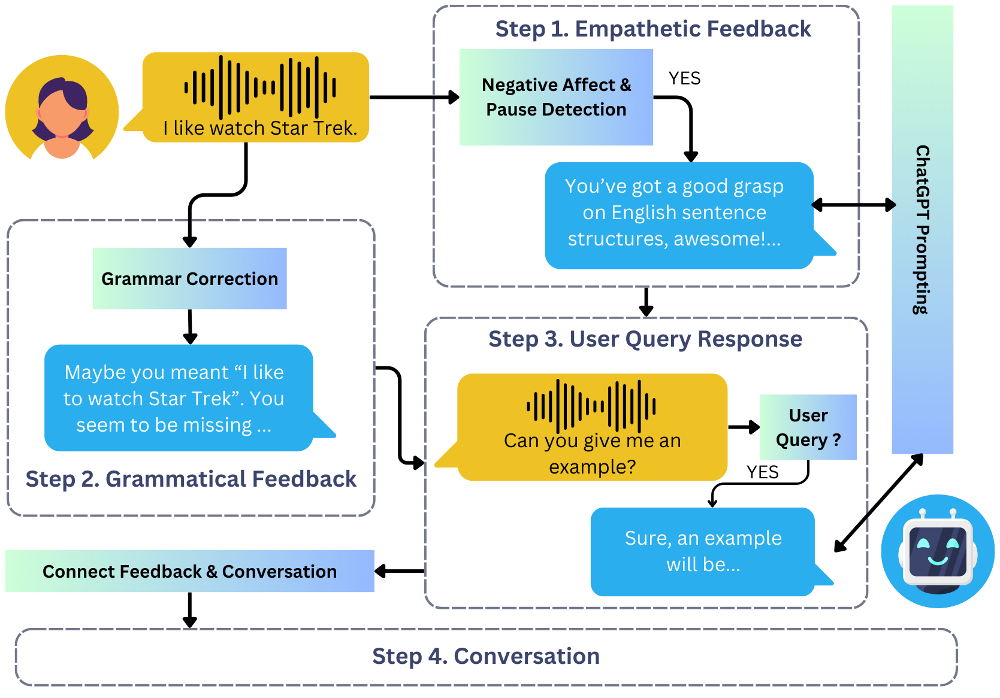

# Using Adaptive Empathetic Responses for Teaching English
Code for our BEA 2024 Submission: Using Adaptive Empathetic Responses for Teaching English.

## Repository Structure
The repository is organized as follows:
- `api_server/`: The code used to run the API server for the bot on the EduBot platform. It is modularized such that you would be able to swap out different components of our pipeline. 
  - Our code for identifying specific type of grammar error given the correction (e.g. narrowing it down to a word order error) is not publicly available, so we have chosen to replace it with direct rephrasing (i.e. directly repeating the corrected user's utterance based on our grammar correction model output). You can replace it with other approaches such as a compounded call to LLMs.
  - We only provide the API server and don't provide the frontend architecture. 
- `audio_emotion_data/`: This is the audio clips we have manually labeled as `Neutral`, `Negative`, `Pauses`, or `Unusable` as specified in the paper.
  - We will be releasing audio clips with verified ASR transcripts around August 2024 after removing all identifiable information.
- `dspy_generations/`: Data we used and the corresponding generations for different conditions for our adaptive empathetic feedback module using DSPy for the user study. Note that this does not include the full set of conversations used to optimize the pipeline. We also include the notebook that we used to optimize our prompt in the same folder for reproducibility. The `emp_bot.json` file includes prompts used for GPT-3.5-Turbo for our bot to generate adaptive empathetic feedback during the bot's run time. Please also reference `api_server/empathy_generation.py`.
- `grammar_model_training/`: Code for training various Flan-T5 and Llama-2-7b models on ErAConD data.

## Training Grammar Models
You can download our fine-tuned Llama-2-7B checkpoint [here](TODO:HUGGINGFACE).

Alternatively, if you want to fine-tune your own Llama-2, please refer to the PEFT script under `grammar_model_training/train_llama.py`. We also include a script for training your Flan-T5 models under the same directory.

1. Please first download the ErAConD data [here](https://github.com/yuanxun-yx/eracond).
2. Modify the respective scripts (`train_sft_llama.py` or `flan_t5_pet_train.py`) with the paths to the data, the desired output directory, and corresponding training parameters.
3. After training the Llama-2 model, you would need to run `merge_peft.py` to merge the adapter back into the base model.
4. Run the inference scripts (`llama_2_inference.py` and `t5_inference.py`) to generate on the test set.

## Testing Modules
For each component of the pipeline, you would be able to run the files directly to test the functionalities.
